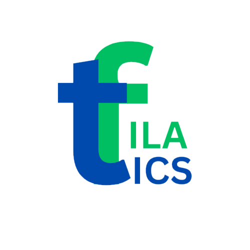

# Filatics - Plastic Recycling Platform

<div align="center">
  
  
  <h3>Turning Plastic Waste Into 3D Printing Filament</h3>
  
  <p>A green startup dedicated to fighting plastic pollution by transforming everyday waste into high-quality 3D printing filament.</p>

  [](https://filatics.com)
  [](https://reactjs.org/)
  [](https://www.typescriptlang.org/)
  [](https://tailwindcss.com/)
</div>

---

## 🌍 About Filatics

Filatics began as a student-led initiative with a single purpose: to fight plastic waste. What started as a small idea quickly grew into a mission — turning discarded plastic bottles into innovative solutions for the future.

### The Problem We're Solving
- **30,590 tonnes** of plastic bottle waste generated annually in Kuala Lumpur
- Malaysia's recycling rate is only **32%**, with **81%** of recycled plastic ending up in landfills
- Plastic pollution threatens ecosystems, human health, and our climate

### Our Solution
We transform plastic waste into high-quality 3D printing filament through our innovative four-step process:
1. **Collect** - Gather clean plastic bottles from communities
2. **Process** - Cut bottles into strips for transformation
3. **Transform** - Use our Polyformer machine to create filament
4. **Create Impact** - Enable sustainable 3D printing innovations

---

## 🏆 Recognition & Awards

- **🥉 4th Place** - Young Technopreneurship Competition (ASTI Malaysia, 2025)
- **💰 RM10,000 Grant** - Taylors University BizPod Program (Top 3 Student Startups, 2025)

---

## 📊 Our Impact

<div align="center">
  
| Metric | Achievement |
|--------|-------------|
| 🍶 **Bottles Collected** | 10,000+ |
| 🎓 **Workshops Hosted** | 20+ |
| 👥 **Community Members** | 500+ |
| ♻️ **Recycling Efficiency** | 95% |

</div>

---

## 🚀 Technology Stack

### Frontend
- **React 18.3.1** - Modern UI library
- **TypeScript** - Type-safe development
- **Tailwind CSS** - Utility-first styling
- **Framer Motion** - Smooth animations
- **React Router** - Client-side routing

### Development Tools
- **Vite** - Fast build tool
- **ESLint** - Code linting
- **PostCSS** - CSS processing
- **Lucide React** - Beautiful icons

### Deployment
- **Bolt Hosting** - Fast, reliable hosting
- **Responsive Design** - Mobile-first approach

---

## 🛠️ Getting Started

### Prerequisites
- Node.js 18+ 
- npm or yarn

### Installation

1. **Clone the repository**
   ```bash
   git clone https://github.com/your-username/filatics-website.git
   cd filatics-website
   ```

2. **Install dependencies**
   ```bash
   npm install
   ```

3. **Start development server**
   ```bash
   npm run dev
   ```

4. **Open your browser**
   ```
   http://localhost:5173
   ```

### Build for Production
```bash
npm run build
npm run preview
```

---

## 📝 Content Management

For non-technical users who want to update website content and images, please see our detailed guide:

**📖 [Content Management Guide](CONTENT_MANAGEMENT_GUIDE.md)**

This guide covers:
- ✏️ How to update text content
- 🖼️ How to add/change images
- 👥 How to manage team members
- 🏆 How to add awards and sponsors
- 🎓 How to manage workshops

---

## 🏗️ Project Structure

```
filatics-website/
├── 📁 public/
│   ├── 📁 images/          # Local image storage
│   │   ├── 📁 hero/        # Banner images
│   │   ├── 📁 team/        # Team photos
│   │   ├── 📁 sponsors/    # Company logos
│   │   ├── 📁 awards/      # Award images
│   │   └── 📁 workshops/   # Event photos
│   └── Logo_edited_edited.png
├── 📁 src/
│   ├── 📁 components/      # Reusable UI components
│   ├── 📁 data/           # Content data files
│   │   ├── homeData.ts    # Home page content
│   │   ├── aboutData.ts   # About page content
│   │   ├── contactData.ts # Contact page content
│   │   └── workshopsData.ts # Workshops content
│   ├── 📁 pages/          # Page components
│   ├── 📁 utils/          # Utility functions
│   └── App.tsx            # Main app component
└── 📄 Configuration files
```

---

## 🌟 Key Features

### 🎨 **Modern Design**
- Clean, professional interface
- Smooth animations and transitions
- Mobile-responsive design
- Accessibility-focused

### 📱 **User Experience**
- Fast loading times
- Intuitive navigation
- Interactive elements
- SEO optimized

### 🔧 **Easy Management**
- Simple content updates
- Organized file structure
- Non-technical friendly
- Version controlled

### 🌐 **Multi-Page Website**
- **Home** - Mission and impact overview
- **About** - Company story and values
- **Workshops** - Educational programs
- **Recycling Guide** - How-to instructions
- **Contact** - Team and contact information

---

## 👥 Team

<div align="center">

| Role | Name | Expertise |
|------|------|-----------|
| **CEO** | Bryant Yong Yik Hong | Mechanical Engineering & 3D Printing |
| **COO** | Ng Ee Zhen | Electronics Engineering & Robotics |
| **CMO** | Bee Xiang Zi | Entrepreneurship & Marketing |

</div>

---

## 🤝 Contributing

We welcome contributions from the community! Here's how you can help:

### For Developers
1. Fork the repository
2. Create a feature branch (`git checkout -b feature/amazing-feature`)
3. Commit your changes (`git commit -m 'Add amazing feature'`)
4. Push to the branch (`git push origin feature/amazing-feature`)
5. Open a Pull Request

### For Content Contributors
- Use our [Content Management Guide](CONTENT_MANAGEMENT_GUIDE.md)
- Submit content updates via issues or pull requests
- Help improve documentation

### Areas We Need Help With
- 🌐 Translations (Bahasa Malaysia, Chinese)
- 📝 Content writing and editing
- 🎨 UI/UX improvements
- 📱 Mobile optimization
- ♿ Accessibility enhancements

---

## 📞 Contact & Support

### Get In Touch
- **📧 Email**: filatics25@gmail.com
- **📱 Phone**: +60 16-3589385
- **📍 Location**: Kuala Lumpur, Malaysia

### Follow Us
- **Instagram**: [@filatics.3d](https://www.instagram.com/filatics.3d)
- **LinkedIn**: [Filatics Company](https://www.linkedin.com/company/filatics2025)

### Join Our Community
- **WhatsApp**: [Community Group](https://wa.me/60163589385)
- **Workshops**: [Register Here](https://forms.google.com/your-workshop-form)

---

## 📄 License

This project is licensed under the MIT License - see the [LICENSE](LICENSE) file for details.

---

## 🙏 Acknowledgments

- **Taylors University** - For the BizPod Grant and support
- **ASTI Malaysia** - For recognizing our innovation
- **Our Community** - For supporting our mission
- **Open Source Community** - For the amazing tools and libraries

---

<div align="center">
  
### 🌱 Together, we're building a sustainable future, one bottle at a time.

**[Visit Our Website](https://filatics.com)** • **[Join Our Community](https://wa.me/60163589385)** • **[Start Recycling](https://filatics.com/recycling)**

</div>

---

<div align="center">
  <sub>Built with ❤️ by the Filatics Team</sub>
</div>